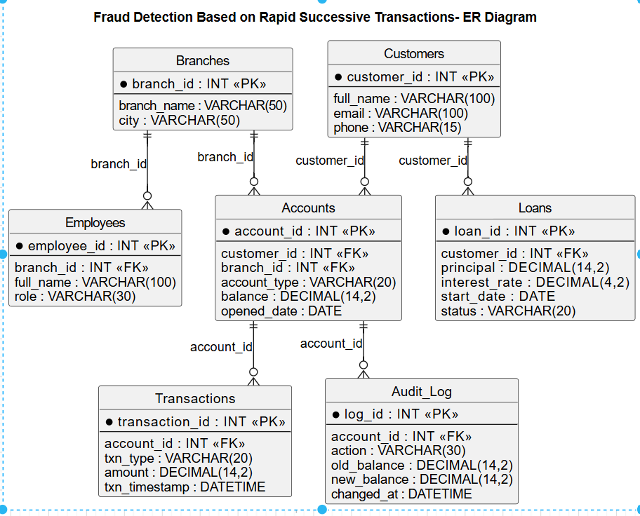

#  Bank Transaction & Fraud Monitoring System

A comprehensive **MySQL 8.0** database project that simulates a real-world banking system. This project demonstrates database design, SQL programming, business logic implementation, and fraud detection using advanced SQL concepts commonly used in enterprise banking applications.

---

# Project Overview

Banks process thousands of financial transactions every day, including deposits, withdrawals, fund transfers, and loan operations. Managing these transactions requires a secure, scalable, and well-designed relational database.

This project was developed to simulate a real-world banking environment using **MySQL**. It focuses on maintaining customer and banking data while implementing advanced SQL techniques to generate reports, automate business logic, and detect suspicious transaction patterns.

---

#  Project Objectives

- Design a normalized relational database (3NF)
- Manage customers, branches, employees, accounts, loans, and transactions
- Perform CRUD operations using SQL
- Implement business rules using Stored Procedures and Triggers
- Generate analytical reports using SQL
- Detect fraudulent banking transactions
- Demonstrate advanced SQL concepts for SQL Developer interviews

---

# 🛠 Technologies Used

- MySQL 8.0
- MySQL Workbench
- SQL
- Window Functions
- Stored Procedures
- Triggers

---

# 🗄 Database Schema

## Tables

- Branches
- Customers
- Employees
- Accounts
- Transactions
- Loans
- Audit_Log

---

#  Entity Relationship Diagram

The database schema follows Third Normal Form (3NF) with proper primary key and foreign key relationships.



---

#  Features

- Normalized Database Design (3NF)
- Primary & Foreign Keys
- Constraints
  - NOT NULL
  - UNIQUE
  - CHECK
  - DEFAULT
- Aggregate Functions
- GROUP BY
- HAVING
- INNER JOIN
- LEFT JOIN
- Subqueries
- Correlated Subqueries
- Common Table Expressions (CTEs)
- Window Functions
- Views
- Stored Procedures
- Triggers
- TCL Commands
- Fraud Detection Analytics

---

#  SQL Concepts Covered

## Database Design

- DDL
- DML
- DQL
- Constraints
- Relationships

## SQL Queries

- SELECT
- WHERE
- ORDER BY
- LIMIT
- DISTINCT

## Aggregate Functions

- COUNT()
- SUM()
- AVG()
- MIN()
- MAX()

## GROUP BY & HAVING

- Branch-wise reports
- Customer statistics
- Transaction summaries

## Joins

- INNER JOIN
- LEFT JOIN
- Multi-table JOIN

## Subqueries

- Scalar Subqueries
- Correlated Subqueries
- EXISTS
- NOT EXISTS

## Common Table Expressions (CTEs)

- Recursive Reports
- Analytical Queries

## Window Functions

- ROW_NUMBER()
- RANK()
- DENSE_RANK()
- LAG()
- LEAD()
- NTILE()
- Running Total

## Views

- Account Summary
- Monthly Branch Summary

## Stored Procedures

- Transfer Money
- Apply Monthly Interest

## Triggers

- Audit Log Trigger
- Prevent Overdraft Trigger

## TCL

- COMMIT
- ROLLBACK
- SAVEPOINT

---

#  Fraud Detection Module

## Business Use Case

Banks continuously monitor customer transactions to identify suspicious activities that may indicate fraudulent behavior.

This project implements a SQL-based fraud detection system that identifies rapid successive transactions occurring on the same account.

---

## Fraud Detection Logic

The system compares every transaction with the previous transaction of the same account using the **LAG()** Window Function.

The time difference is calculated using **TIMESTAMPDIFF()** and classified into different fraud risk levels.

### Fraud Risk Classification

| Time Gap | Risk Level |
|----------|------------|
| First Transaction | 🟢 First Transaction |
| 0 – 30 Seconds | 🔴 High Risk |
| 31 – 60 Seconds | 🟠 Medium Risk |
| Above 60 Seconds | 🟢 Normal |

---

## SQL Concepts Used

- CTE
- LAG()
- PARTITION BY
- ORDER BY
- TIMESTAMPDIFF()
- CASE Statement

---

# 📈 Reports Generated

- Customer Account Summary
- Branch-wise Balance Summary
- Monthly Deposit Summary
- Transaction Volume Analysis
- Loan Reports
- Fraud Detection Report
- Audit Log Report

---

# 📸 Project Demonstration

The project demonstrates:

- Database Design
- Table Relationships
- Sample Data
- Aggregate Queries
- GROUP BY Reports
- JOIN Queries
- Subqueries
- Views
- Stored Procedures
- Triggers
- Fraud Detection
- TCL Commands

---

# 📂 Project Structure

```
Bank-Transaction-Fraud-Monitoring-System
│
├── README.md
├── Bank_FraudDetection.sql
├── ER-DIAGRAM.png
├── screenshots
│   ├── schema.png
│   ├── stored-procedure.png
│   ├── trigger.png
│   ├── fraud-detection.png
│   └── reports.png
```

---

# 🎓 Learning Outcomes

This project helped me gain practical experience in:

- Relational Database Design
- SQL Programming
- Advanced SQL Query Writing
- Analytical SQL
- Banking Database Design
- Business Rule Implementation
- Fraud Detection using SQL
- Enterprise Reporting
- Transaction Management
- Performance-Oriented SQL Development

---

# 🚀 Future Enhancements

- Multi-account fund transfers
- Credit Card Management
- Online Banking Module
- ATM Transaction Module
- Interest Calculation Scheduler
- Loan EMI Management
- Role-Based Access Control
- Dashboard Integration using Power BI

---

# 👨‍💻 Author

**S. Harisiva Balan**

Computer Science Engineer | SQL Developer | Full Stack Developer

---

# Key Highlights

✔ Real-world Banking Database Design

✔ MySQL 8.0 Compatible

✔ 3NF Normalized Schema

✔ Advanced SQL Queries

✔ Stored Procedures

✔ Triggers

✔ Views

✔ Window Functions

✔ Fraud Detection System

✔ SQL Developer Portfolio Project
